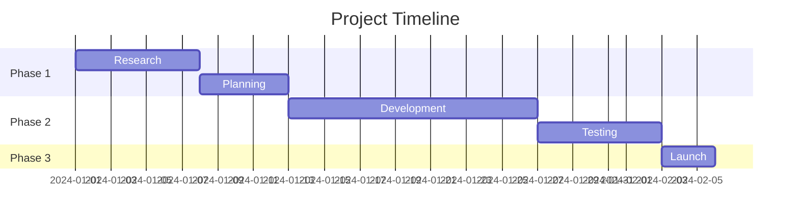

# Learning & Productivity Implementation Plan

## Overview

This document outlines the implementation plan for **Priority 5: Learning & Productivity** features in the Wants chat system. These features will integrate seamlessly into the existing chat interface, leveraging the established intent classification, contextual UI, and streaming response patterns.

**Key Principle**: All features work through the same chat window - no separate pages or apps needed.

---

## Features Scope

```
Learning & Productivity
├── Tutoring & Explanations
│   ├── Concept breakdowns with visualizations
│   ├── Step-by-step problem solving
│   ├── Adaptive difficulty based on user level
│   ├── Practice question generation
│   └── Knowledge assessment
│
├── Document Summarization
│   ├── PDF/DOCX/URL content extraction
│   ├── Multi-level summaries (brief/detailed/executive)
│   ├── Key points extraction
│   ├── Q&A from documents
│   └── Export to different formats
│
├── Life Organization
│   ├── Schedule creation & management
│   ├── Goal setting with milestones
│   ├── Project planning with timelines
│   ├── Habit tracking suggestions
│   └── Priority management
│
└── Writing Assistance
    ├── Email composition (professional/casual)
    ├── Essay structuring & writing
    ├── Report generation
    ├── Tone adjustment & proofreading
    └── Template suggestions
```

---

## Architecture Design

### Integration Approach

The Learning & Productivity features will integrate using the existing Wants patterns:

```
User Message (Chat)
       ↓
Intent Classification (Enhanced)
       ↓
┌──────────────────────────────────────────────────┐
│  New Intent Category: 'learning_productivity'    │
│  Sub-types:                                       │
│  - tutoring: "explain X", "teach me about Y"     │
│  - summarize: "summarize this PDF", "TLDR"       │
│  - organize: "plan my week", "create schedule"   │
│  - writing: "write an email", "draft a report"  │
└──────────────────────────────────────────────────┘
       ↓
Learning Service (Backend)
       ↓
Streaming Response with:
- Markdown content sections
- Interactive elements (where needed)
- Suggested follow-up tools
```

### System Components

```
┌─────────────────────────────────────────────────────────────┐
│                    BACKEND ADDITIONS                         │
├─────────────────────────────────────────────────────────────┤
│  /src/modules/learning/                                      │
│  ├── learning.module.ts          # NestJS module             │
│  ├── learning.service.ts         # Core learning logic       │
│  ├── learning.controller.ts      # REST endpoints            │
│  ├── agents/                     # Specialized agents        │
│  │   ├── tutor.agent.ts          # Tutoring logic            │
│  │   ├── summarizer.agent.ts     # Document processing       │
│  │   ├── planner.agent.ts        # Schedule/goal planning    │
│  │   └── writer.agent.ts         # Writing assistance        │
│  ├── dto/                        # Data transfer objects     │
│  │   ├── tutoring.dto.ts                                     │
│  │   ├── summarize.dto.ts                                    │
│  │   ├── planning.dto.ts                                     │
│  │   └── writing.dto.ts                                      │
│  └── prompts/                    # System prompts            │
│      ├── tutor.prompts.ts                                    │
│      ├── summarizer.prompts.ts                               │
│      ├── planner.prompts.ts                                  │
│      └── writer.prompts.ts                                   │
├─────────────────────────────────────────────────────────────┤
│  EXISTING MODULE UPDATES                                     │
├─────────────────────────────────────────────────────────────┤
│  /src/modules/intent/                                        │
│  └── intent.service.ts           # Add learning intent type  │
│                                                              │
│  /src/modules/chat/                                          │
│  └── chat.gateway.ts             # Route learning intents    │
└─────────────────────────────────────────────────────────────┘

┌─────────────────────────────────────────────────────────────┐
│                    FRONTEND ADDITIONS                        │
├─────────────────────────────────────────────────────────────┤
│  /src/components/learning/        # Learning UI components   │
│  ├── TutoringPanel.tsx           # Interactive tutoring UI   │
│  ├── SummaryCard.tsx             # Document summary display  │
│  ├── PlannerWidget.tsx           # Schedule/goal widget      │
│  ├── WritingAssistant.tsx        # Writing helper panel      │
│  └── QuizCard.tsx                # Practice questions        │
│                                                              │
│  /src/components/chat/                                       │
│  └── MessageContent.tsx          # Enhanced for learning UI  │
└─────────────────────────────────────────────────────────────┘
```

---

## Feature Specifications

### 1. Tutoring & Explanations

**Trigger Examples**:
- "Explain quantum entanglement"
- "Teach me about machine learning"
- "How does photosynthesis work?"
- "Break down the concept of recursion"
- "Help me understand calculus derivatives"

**Response Format**:
```markdown
# Understanding [Topic]

## Quick Overview
[2-3 sentence summary]

## Key Concepts
1. **Concept 1**: Explanation
2. **Concept 2**: Explanation
3. **Concept 3**: Explanation

## Detailed Explanation
[Step-by-step breakdown with examples]

## Real-World Analogy
[Relatable comparison to make concept clearer]

## Practice Question
> [Question to test understanding]

---
**Want to go deeper?**
**Practice Quiz** - Test your knowledge
**Related Topics** - Explore connected concepts
```

**Adaptive Features**:
- Detects user's knowledge level from conversation context
- Adjusts complexity based on follow-up questions
- Tracks concepts explained in memory for continuity
- Generates progressively harder practice questions

**Backend Logic**:
```typescript
// TutorAgent approach (inspired by DeepTutor's dual-loop)
async explain(topic: string, userContext: UserContext): Promise<TutoringResponse> {
  // 1. Assess what user already knows (from memory/context)
  const knowledgeLevel = await this.assessLevel(topic, userContext);

  // 2. Plan explanation structure
  const plan = await this.planExplanation(topic, knowledgeLevel);

  // 3. Generate content with appropriate depth
  const content = await this.generateExplanation(plan);

  // 4. Create practice questions
  const questions = await this.generateQuestions(topic, knowledgeLevel);

  // 5. Store learning progress in memory
  await this.memoryService.store({
    category: 'learning',
    content: `Explained ${topic} at ${knowledgeLevel} level`,
    userId: userContext.userId
  });

  return { content, questions, followUpTopics };
}
```

---

### 2. Document Summarization

**Trigger Examples**:
- "Summarize this PDF" (with file upload)
- "Give me the key points from [URL]"
- "TLDR of this article"
- "What's the main argument in this paper?"
- "Extract action items from this document"

**Input Methods**:
1. **File Upload**: PDF, DOCX, TXT via chat attachment
2. **URL**: Paste link for web content extraction
3. **Paste Text**: Direct text input for quick summaries

**Response Format**:
```markdown
# Summary: [Document Title]

## Executive Summary
[1 paragraph overview]

## Key Points
- Point 1
- Point 2
- Point 3
- Point 4
- Point 5

## Main Themes
| Theme | Description | Relevance |
|-------|-------------|-----------|
| Theme 1 | ... | High |
| Theme 2 | ... | Medium |

## Notable Quotes
> "Important quote from document" - Source

## Action Items (if applicable)
- [ ] Action 1
- [ ] Action 2

## Questions This Document Answers
1. Question 1
2. Question 2

---
**What would you like to do?**
**Ask Questions** - Query this document
**Detailed Analysis** - Deep dive into specific sections
**Export Summary** - Save as PDF/DOCX
```

**Backend Logic**:
```typescript
// SummarizerAgent
async summarize(input: SummarizeInput): Promise<SummaryResponse> {
  // 1. Extract content based on input type
  const content = await this.extractContent(input);

  // 2. Chunk if document is large (>10k tokens)
  const chunks = this.chunkContent(content);

  // 3. Generate summaries per chunk
  const chunkSummaries = await Promise.all(
    chunks.map(chunk => this.summarizeChunk(chunk))
  );

  // 4. Synthesize final summary
  const synthesis = await this.synthesize(chunkSummaries);

  // 5. Extract key points and themes
  const keyPoints = await this.extractKeyPoints(synthesis);

  // 6. Store document context for Q&A
  await this.storeDocumentContext(input.documentId, content);

  return { summary: synthesis, keyPoints, themes };
}
```

---

### 3. Life Organization

**Trigger Examples**:
- "Plan my week"
- "Create a study schedule for my exam"
- "Help me set goals for this quarter"
- "Make a project timeline for my app"
- "Organize my daily routine"

**Sub-Features**:

#### A. Schedule Creation
```markdown
# Your Weekly Schedule

## Overview
Based on your goals and availability, here's an optimized schedule:

## Monday
| Time | Activity | Priority | Duration |
|------|----------|----------|----------|
| 9:00 AM | Deep work block | High | 2h |
| 11:00 AM | Meetings | Medium | 1h |
| 1:00 PM | Lunch & break | - | 1h |
| 2:00 PM | Project work | High | 3h |
| 5:00 PM | Review & plan | Medium | 30m |

## Weekly Goals
- [ ] Complete project milestone
- [ ] 3 workout sessions
- [ ] Read 2 chapters

## Time Allocation
- Work: 40 hours
- Personal: 20 hours
- Rest: 56 hours

---
**Quick Actions**
**Add Event** - Schedule something new
**Adjust Schedule** - Modify this plan
**Set Reminder** - Get notified
```

#### B. Goal Setting
```markdown
# Goal Framework: [Your Goal]

## SMART Breakdown
- **Specific**: What exactly will you achieve?
- **Measurable**: How will you track progress?
- **Achievable**: Is this realistic?
- **Relevant**: Why does this matter to you?
- **Time-bound**: When will you complete this?

## Milestones
1. **Week 1-2**: [First milestone]
2. **Week 3-4**: [Second milestone]
3. **Month 2**: [Major checkpoint]
4. **Month 3**: [Goal completion]

## Daily Actions
- Action 1 (15 min/day)
- Action 2 (30 min/day)
- Action 3 (1 hour/day)

## Potential Obstacles & Solutions
| Obstacle | Solution |
|----------|----------|
| Time constraints | Wake up 1 hour earlier |
| Motivation dips | Accountability partner |

---
**Track This Goal**
**Set Milestones** - Add checkpoints
**Daily Check-in** - Log progress
```

#### C. Project Planning
```markdown
# Project Plan: [Project Name]

## Project Overview
[Brief description]

## Timeline


## Tasks Breakdown
### Phase 1: Research (Week 1)
- [ ] Task 1
- [ ] Task 2
- [ ] Task 3

### Phase 2: Development (Week 2-3)
- [ ] Task 4
- [ ] Task 5

## Resources Needed
- Resource 1
- Resource 2

## Risk Assessment
| Risk | Probability | Impact | Mitigation |
|------|-------------|--------|------------|
| Risk 1 | Medium | High | Plan B |

---
**Manage Project**
**Update Progress** - Mark tasks complete
**Adjust Timeline** - Modify dates
**Add Tasks** - New items
```

---

### 4. Writing Assistance

**Trigger Examples**:
- "Write a professional email to..."
- "Help me draft an essay about..."
- "Create a report on..."
- "Make this more formal"
- "Proofread my text"

**Sub-Features**:

#### A. Email Composition
```markdown
# Email Draft

**To**: [Recipient]
**Subject**: [Generated subject line]

---

Dear [Name],

[Opening paragraph - context setting]

[Body paragraph 1 - main point]

[Body paragraph 2 - supporting details]

[Closing paragraph - call to action]

Best regards,
[Your name]

---

## Tone Analysis
- **Current**: Professional, friendly
- **Formality Level**: 7/10

## Suggestions
- Consider adding specific dates
- The call-to-action could be stronger

**Adjust Tone**
**More Formal** | **More Casual** | **More Direct**

**Copy to Clipboard** - Ready to send
```

#### B. Essay Assistance
```markdown
# Essay: [Topic]

## Outline
1. **Introduction**
   - Hook: [Attention-grabbing opening]
   - Context: [Background information]
   - Thesis: [Main argument]

2. **Body Paragraph 1**
   - Topic sentence
   - Evidence
   - Analysis
   - Transition

3. **Body Paragraph 2**
   - Topic sentence
   - Evidence
   - Analysis
   - Transition

4. **Body Paragraph 3**
   - Topic sentence
   - Evidence
   - Analysis
   - Transition

5. **Conclusion**
   - Restate thesis
   - Summarize key points
   - Final thought

---

## Draft

[Full essay text with proper formatting]

---

## Writing Metrics
- Word count: 750
- Reading level: College
- Tone: Academic

**Improve Essay**
**Expand Section** - Add more detail
**Strengthen Arguments** - Better evidence
**Check Citations** - Verify sources
```

#### C. Report Generation
```markdown
# Report: [Title]

## Executive Summary
[Brief overview of findings]

## 1. Introduction
### 1.1 Background
### 1.2 Objectives
### 1.3 Methodology

## 2. Findings
### 2.1 Key Finding 1
### 2.2 Key Finding 2
### 2.3 Key Finding 3

## 3. Analysis
[Detailed analysis with charts/tables]

## 4. Recommendations
1. Recommendation 1
2. Recommendation 2
3. Recommendation 3

## 5. Conclusion

## Appendix
[Supporting data]

---
**Export Report**
**PDF** | **DOCX** | **Markdown**
```

---

## Technical Implementation

### Phase 1: Backend Foundation

#### 1.1 Create Learning Module

```typescript
// /backend/src/modules/learning/learning.module.ts
@Module({
  imports: [
    AiModule,
    MemoryModule,
    DocumentModule,
    ConfigModule,
  ],
  controllers: [LearningController],
  providers: [
    LearningService,
    TutorAgent,
    SummarizerAgent,
    PlannerAgent,
    WriterAgent,
  ],
  exports: [LearningService],
})
export class LearningModule {}
```

#### 1.2 Update Intent Classification

Add to `UnifiedIntentCategory`:
```typescript
export type UnifiedIntentCategory =
  | 'app_creation'
  | 'web_action'
  | 'contextual_ui'
  | 'workflow'
  | 'existing_app'
  | 'file_action'
  | 'learning_productivity'  // NEW
  | 'chat';

// Sub-classification for learning
export type LearningSubType =
  | 'tutoring'      // explain, teach, help understand
  | 'summarize'     // summarize, TLDR, key points
  | 'organize'      // plan, schedule, goals, timeline
  | 'writing';      // write, draft, compose, email
```

#### 1.3 Intent Detection Prompt Update

```typescript
const LEARNING_EXAMPLES = `
- "explain quantum physics" → learning_productivity (tutoring)
- "teach me about React hooks" → learning_productivity (tutoring)
- "summarize this PDF" → learning_productivity (summarize)
- "give me the key points" → learning_productivity (summarize)
- "plan my week" → learning_productivity (organize)
- "create a study schedule" → learning_productivity (organize)
- "set goals for Q1" → learning_productivity (organize)
- "write an email to my boss" → learning_productivity (writing)
- "draft a report on sales" → learning_productivity (writing)
- "make this more professional" → learning_productivity (writing)
`;
```

### Phase 2: Agent Implementation

#### 2.1 Base Learning Agent

```typescript
// /backend/src/modules/learning/agents/base-learning.agent.ts
export abstract class BaseLearningAgent {
  constructor(
    protected readonly aiService: AiService,
    protected readonly memoryService: MemoryService,
    protected readonly configService: ConfigService,
  ) {}

  abstract process(input: any, context: UserContext): Promise<any>;

  protected async getSystemPrompt(type: string): Promise<string> {
    // Load from prompts directory
  }

  protected async getUserContext(userId: string): Promise<UserContext> {
    const memories = await this.memoryService.search(userId, {
      category: 'learning',
      limit: 10,
    });
    return { memories, preferences: await this.getPreferences(userId) };
  }

  protected async storeProgress(
    userId: string,
    topic: string,
    level: string,
  ): Promise<void> {
    await this.memoryService.create({
      userId,
      category: 'learning',
      content: `Studied ${topic} at ${level} level`,
      source: 'extracted',
    });
  }
}
```

#### 2.2 Tutor Agent

```typescript
// /backend/src/modules/learning/agents/tutor.agent.ts
@Injectable()
export class TutorAgent extends BaseLearningAgent {
  async process(input: TutoringInput, context: UserContext): Promise<TutoringResponse> {
    const { topic, depth = 'standard', includeQuiz = true } = input;

    // 1. Assess user's current knowledge level
    const level = await this.assessKnowledgeLevel(topic, context);

    // 2. Generate explanation with appropriate depth
    const explanation = await this.aiService.chat([
      { role: 'system', content: await this.getTutorPrompt(level, depth) },
      { role: 'user', content: `Explain: ${topic}` },
    ], {
      model: 'gpt-4o',
      temperature: 0.7,
    });

    // 3. Generate practice questions if requested
    let questions: QuizQuestion[] = [];
    if (includeQuiz) {
      questions = await this.generateQuestions(topic, level);
    }

    // 4. Store learning progress
    await this.storeProgress(context.userId, topic, level);

    return {
      content: explanation,
      questions,
      level,
      suggestedTopics: await this.getRelatedTopics(topic),
    };
  }

  private async assessKnowledgeLevel(
    topic: string,
    context: UserContext
  ): Promise<'beginner' | 'intermediate' | 'advanced'> {
    const relatedMemories = context.memories.filter(m =>
      m.content.toLowerCase().includes(topic.toLowerCase())
    );

    if (relatedMemories.length === 0) return 'beginner';
    if (relatedMemories.length < 5) return 'intermediate';
    return 'advanced';
  }
}
```

#### 2.3 Summarizer Agent

```typescript
// /backend/src/modules/learning/agents/summarizer.agent.ts
@Injectable()
export class SummarizerAgent extends BaseLearningAgent {
  constructor(
    aiService: AiService,
    memoryService: MemoryService,
    configService: ConfigService,
    private readonly documentService: DocumentService,
    private readonly webService: WebService,
  ) {
    super(aiService, memoryService, configService);
  }

  async process(input: SummarizeInput, context: UserContext): Promise<SummaryResponse> {
    // 1. Extract content based on source type
    let content: string;

    if (input.type === 'file') {
      content = await this.documentService.extractText(input.fileId);
    } else if (input.type === 'url') {
      content = await this.webService.extractContent(input.url);
    } else {
      content = input.text;
    }

    // 2. Check content length and chunk if needed
    const tokens = this.estimateTokens(content);

    if (tokens > 10000) {
      return this.summarizeLongDocument(content, input.options);
    }

    // 3. Generate summary
    const summary = await this.aiService.chat([
      { role: 'system', content: await this.getSummarizerPrompt(input.options) },
      { role: 'user', content: `Summarize:\n\n${content}` },
    ], {
      model: 'gpt-4o',
      temperature: 0.3,
    });

    // 4. Extract structured data
    const keyPoints = await this.extractKeyPoints(content);
    const themes = await this.identifyThemes(content);

    return {
      summary,
      keyPoints,
      themes,
      wordCount: content.split(' ').length,
      readingTime: Math.ceil(content.split(' ').length / 200),
    };
  }

  private async summarizeLongDocument(
    content: string,
    options: SummarizeOptions
  ): Promise<SummaryResponse> {
    // Chunk and summarize iteratively (inspired by DeepTutor's approach)
    const chunks = this.chunkByParagraphs(content, 3000);

    const chunkSummaries = await Promise.all(
      chunks.map(chunk => this.summarizeChunk(chunk))
    );

    // Synthesize final summary
    const synthesis = await this.aiService.chat([
      { role: 'system', content: 'Synthesize these section summaries into a cohesive overview.' },
      { role: 'user', content: chunkSummaries.join('\n\n---\n\n') },
    ]);

    return {
      summary: synthesis,
      keyPoints: await this.extractKeyPoints(synthesis),
      themes: await this.identifyThemes(synthesis),
      wordCount: content.split(' ').length,
      readingTime: Math.ceil(content.split(' ').length / 200),
    };
  }
}
```

#### 2.4 Planner Agent

```typescript
// /backend/src/modules/learning/agents/planner.agent.ts
@Injectable()
export class PlannerAgent extends BaseLearningAgent {
  async process(input: PlanningInput, context: UserContext): Promise<PlanningResponse> {
    const { planType, details } = input;

    switch (planType) {
      case 'schedule':
        return this.createSchedule(details, context);
      case 'goals':
        return this.createGoalPlan(details, context);
      case 'project':
        return this.createProjectPlan(details, context);
      case 'study':
        return this.createStudyPlan(details, context);
      default:
        return this.createGenericPlan(details, context);
    }
  }

  private async createSchedule(
    details: ScheduleDetails,
    context: UserContext
  ): Promise<ScheduleResponse> {
    const { duration, activities, constraints } = details;

    const schedule = await this.aiService.chat([
      { role: 'system', content: await this.getSchedulerPrompt() },
      { role: 'user', content: JSON.stringify({ duration, activities, constraints }) },
    ], {
      model: 'gpt-4o',
      responseFormat: 'json_object',
    });

    const parsed = JSON.parse(schedule);

    return {
      type: 'schedule',
      content: this.formatScheduleMarkdown(parsed),
      data: parsed,
      suggestions: parsed.suggestions,
    };
  }

  private async createGoalPlan(
    details: GoalDetails,
    context: UserContext
  ): Promise<GoalPlanResponse> {
    const { goal, timeline, currentSituation } = details;

    // Generate SMART goal breakdown
    const plan = await this.aiService.chat([
      { role: 'system', content: await this.getGoalPlannerPrompt() },
      { role: 'user', content: `Goal: ${goal}\nTimeline: ${timeline}\nCurrent: ${currentSituation}` },
    ], {
      model: 'gpt-4o',
      responseFormat: 'json_object',
    });

    const parsed = JSON.parse(plan);

    return {
      type: 'goals',
      content: this.formatGoalPlanMarkdown(parsed),
      data: parsed,
      milestones: parsed.milestones,
      dailyActions: parsed.dailyActions,
    };
  }
}
```

#### 2.5 Writer Agent

```typescript
// /backend/src/modules/learning/agents/writer.agent.ts
@Injectable()
export class WriterAgent extends BaseLearningAgent {
  async process(input: WritingInput, context: UserContext): Promise<WritingResponse> {
    const { writingType, details, tone = 'professional' } = input;

    switch (writingType) {
      case 'email':
        return this.composeEmail(details, tone, context);
      case 'essay':
        return this.writeEssay(details, context);
      case 'report':
        return this.generateReport(details, context);
      case 'proofread':
        return this.proofreadText(details.text, context);
      case 'adjust_tone':
        return this.adjustTone(details.text, details.targetTone, context);
      default:
        return this.generalWriting(details, context);
    }
  }

  private async composeEmail(
    details: EmailDetails,
    tone: string,
    context: UserContext
  ): Promise<EmailResponse> {
    const { recipient, purpose, keyPoints, urgency } = details;

    const email = await this.aiService.chat([
      { role: 'system', content: await this.getEmailPrompt(tone) },
      { role: 'user', content: JSON.stringify({ recipient, purpose, keyPoints, urgency }) },
    ], {
      model: 'gpt-4o',
      temperature: 0.6,
    });

    // Analyze the generated email
    const analysis = await this.analyzeWriting(email);

    return {
      type: 'email',
      content: email,
      analysis: {
        tone: analysis.tone,
        formalityLevel: analysis.formality,
        suggestions: analysis.improvements,
      },
      metadata: {
        wordCount: email.split(' ').length,
        readingTime: Math.ceil(email.split(' ').length / 200),
      },
    };
  }

  private async writeEssay(
    details: EssayDetails,
    context: UserContext
  ): Promise<EssayResponse> {
    const { topic, type, wordCount, thesis } = details;

    // 1. Generate outline first
    const outline = await this.generateOutline(topic, type, thesis);

    // 2. Write each section
    const sections = await Promise.all(
      outline.sections.map(section =>
        this.writeSection(section, outline.thesis, context)
      )
    );

    // 3. Combine and polish
    const essay = await this.polishEssay(sections.join('\n\n'), wordCount);

    return {
      type: 'essay',
      content: essay,
      outline,
      metrics: {
        wordCount: essay.split(' ').length,
        paragraphs: essay.split('\n\n').length,
        readingLevel: await this.assessReadingLevel(essay),
      },
    };
  }
}
```

### Phase 3: Chat Gateway Integration

```typescript
// Update /backend/src/modules/chat/chat.gateway.ts

@SubscribeMessage('message:send')
async handleSendMessage(
  @ConnectedSocket() client: Socket,
  @MessageBody() payload: SendMessagePayload,
): Promise<void> {
  // ... existing authentication and setup ...

  // Classify intent
  const intentResult = await this.intentService.classifyUnifiedIntent(
    payload.message,
    conversationContext,
  );

  // Handle learning_productivity intent
  if (intentResult.category === 'learning_productivity') {
    await this.handleLearningIntent(
      client,
      payload,
      intentResult,
      userId,
      conversationId,
    );
    return;
  }

  // ... rest of existing logic ...
}

private async handleLearningIntent(
  client: Socket,
  payload: SendMessagePayload,
  intentResult: UnifiedIntentClassification,
  userId: string,
  conversationId: string,
): Promise<void> {
  const { subType, extractedData } = intentResult;
  const messageId = uuidv4();

  // Emit stream start
  client.emit('stream:start', {
    messageId,
    sessionId: payload.sessionId,
    timestamp: new Date().toISOString(),
  });

  try {
    let response: any;

    switch (subType) {
      case 'tutoring':
        response = await this.learningService.tutor({
          topic: extractedData.topic,
          query: payload.message,
          userId,
        });
        break;
      case 'summarize':
        response = await this.learningService.summarize({
          text: extractedData.text,
          url: extractedData.url,
          fileId: extractedData.fileId,
          userId,
        });
        break;
      case 'organize':
        response = await this.learningService.plan({
          planType: extractedData.planType,
          details: extractedData,
          userId,
        });
        break;
      case 'writing':
        response = await this.learningService.write({
          writingType: extractedData.writingType,
          details: extractedData,
          userId,
        });
        break;
    }

    // Stream the response
    await this.streamResponse(client, messageId, payload.sessionId, response.content);

    // Emit stream end with suggested tools
    client.emit('stream:end', {
      messageId,
      sessionId: payload.sessionId,
      fullContent: response.content,
      suggestedTools: response.suggestedTools || [],
      metadata: response.metadata,
      timestamp: new Date().toISOString(),
    });

    // Persist message
    await this.chatService.createMessage({
      conversationId,
      content: response.content,
      role: 'assistant',
      metadata: {
        intent: intentResult,
        learningData: response.data,
      },
    });

  } catch (error) {
    client.emit('stream:error', {
      messageId,
      error: error.message,
    });
  }
}
```

### Phase 4: Frontend Components

#### 4.1 Learning Content Renderer

```typescript
// /frontend/src/components/learning/LearningContent.tsx
interface LearningContentProps {
  content: string;
  type: 'tutoring' | 'summary' | 'plan' | 'writing';
  metadata?: LearningMetadata;
  onAction?: (action: string, data?: any) => void;
}

export function LearningContent({
  content,
  type,
  metadata,
  onAction
}: LearningContentProps) {
  return (
    <div className="learning-content">
      <MessageContent
        content={content}
        enableTypewriter={true}
      />

      {type === 'tutoring' && metadata?.questions && (
        <QuizCard
          questions={metadata.questions}
          onComplete={(results) => onAction?.('quiz_complete', results)}
        />
      )}

      {type === 'plan' && metadata?.data && (
        <PlannerWidget
          plan={metadata.data}
          onUpdate={(update) => onAction?.('plan_update', update)}
        />
      )}

      {type === 'writing' && metadata?.analysis && (
        <WritingAnalysis
          analysis={metadata.analysis}
          onAdjust={(tone) => onAction?.('adjust_tone', tone)}
        />
      )}
    </div>
  );
}
```

#### 4.2 Quiz Card Component

```typescript
// /frontend/src/components/learning/QuizCard.tsx
interface QuizCardProps {
  questions: QuizQuestion[];
  onComplete: (results: QuizResults) => void;
}

export function QuizCard({ questions, onComplete }: QuizCardProps) {
  const [currentIndex, setCurrentIndex] = useState(0);
  const [answers, setAnswers] = useState<Record<number, string>>({});
  const [showResults, setShowResults] = useState(false);

  const currentQuestion = questions[currentIndex];

  const handleAnswer = (answer: string) => {
    setAnswers({ ...answers, [currentIndex]: answer });

    if (currentIndex < questions.length - 1) {
      setCurrentIndex(currentIndex + 1);
    } else {
      setShowResults(true);
      const results = calculateResults(questions, answers);
      onComplete(results);
    }
  };

  if (showResults) {
    return <QuizResults results={calculateResults(questions, answers)} />;
  }

  return (
    <Card className="quiz-card mt-4 p-4 bg-blue-50 dark:bg-blue-900/20 rounded-lg">
      <div className="flex justify-between items-center mb-3">
        <span className="text-sm text-gray-500">
          Question {currentIndex + 1} of {questions.length}
        </span>
        <Badge variant="outline">{currentQuestion.difficulty}</Badge>
      </div>

      <h4 className="font-medium mb-4">{currentQuestion.question}</h4>

      <div className="space-y-2">
        {currentQuestion.options.map((option, idx) => (
          <button
            key={idx}
            onClick={() => handleAnswer(option)}
            className="w-full text-left p-3 rounded-md border hover:bg-blue-100
                       dark:hover:bg-blue-800 transition-colors"
          >
            {option}
          </button>
        ))}
      </div>
    </Card>
  );
}
```

---

## Database Schema

```sql
-- Learning progress tracking
CREATE TABLE IF NOT EXISTS learning_sessions (
  id UUID PRIMARY KEY DEFAULT gen_random_uuid(),
  user_id UUID NOT NULL REFERENCES users(id) ON DELETE CASCADE,
  conversation_id UUID REFERENCES conversations(id),

  session_type VARCHAR(20) NOT NULL, -- tutoring, summarize, organize, writing
  topic VARCHAR(255),

  -- Session data
  input_data JSONB DEFAULT '{}',
  output_data JSONB DEFAULT '{}',

  -- Progress tracking
  knowledge_level VARCHAR(20), -- beginner, intermediate, advanced
  quiz_score FLOAT,
  completion_status VARCHAR(20) DEFAULT 'in_progress',

  created_at TIMESTAMP WITH TIME ZONE DEFAULT NOW(),
  updated_at TIMESTAMP WITH TIME ZONE DEFAULT NOW()
);

-- Document summaries for Q&A
CREATE TABLE IF NOT EXISTS document_summaries (
  id UUID PRIMARY KEY DEFAULT gen_random_uuid(),
  user_id UUID NOT NULL REFERENCES users(id) ON DELETE CASCADE,

  source_type VARCHAR(20) NOT NULL, -- file, url, text
  source_reference TEXT, -- file_id, url, or null

  title VARCHAR(255),
  summary TEXT NOT NULL,
  key_points JSONB DEFAULT '[]',
  themes JSONB DEFAULT '[]',

  -- For Q&A capability
  full_content TEXT,
  content_embedding VECTOR(1536),

  word_count INTEGER,
  created_at TIMESTAMP WITH TIME ZONE DEFAULT NOW()
);

-- User goals and plans
CREATE TABLE IF NOT EXISTS user_plans (
  id UUID PRIMARY KEY DEFAULT gen_random_uuid(),
  user_id UUID NOT NULL REFERENCES users(id) ON DELETE CASCADE,

  plan_type VARCHAR(20) NOT NULL, -- schedule, goals, project, study
  title VARCHAR(255) NOT NULL,
  description TEXT,

  plan_data JSONB NOT NULL, -- Full plan structure
  milestones JSONB DEFAULT '[]',

  start_date DATE,
  end_date DATE,
  status VARCHAR(20) DEFAULT 'active', -- active, completed, paused, cancelled

  progress_percentage INTEGER DEFAULT 0,

  created_at TIMESTAMP WITH TIME ZONE DEFAULT NOW(),
  updated_at TIMESTAMP WITH TIME ZONE DEFAULT NOW()
);

-- Writing drafts
CREATE TABLE IF NOT EXISTS writing_drafts (
  id UUID PRIMARY KEY DEFAULT gen_random_uuid(),
  user_id UUID NOT NULL REFERENCES users(id) ON DELETE CASCADE,
  conversation_id UUID REFERENCES conversations(id),

  writing_type VARCHAR(20) NOT NULL, -- email, essay, report, other
  title VARCHAR(255),

  content TEXT NOT NULL,
  version INTEGER DEFAULT 1,

  analysis JSONB DEFAULT '{}', -- tone, formality, suggestions
  metadata JSONB DEFAULT '{}',

  created_at TIMESTAMP WITH TIME ZONE DEFAULT NOW(),
  updated_at TIMESTAMP WITH TIME ZONE DEFAULT NOW()
);

-- Indexes
CREATE INDEX idx_learning_sessions_user ON learning_sessions(user_id);
CREATE INDEX idx_learning_sessions_type ON learning_sessions(session_type);
CREATE INDEX idx_document_summaries_user ON document_summaries(user_id);
CREATE INDEX idx_user_plans_user ON user_plans(user_id);
CREATE INDEX idx_user_plans_status ON user_plans(status);
CREATE INDEX idx_writing_drafts_user ON writing_drafts(user_id);
```

---

## Implementation Phases

### Phase 1: Foundation (Core Backend)
- [ ] Create learning module structure
- [ ] Update intent classification for learning_productivity
- [ ] Implement base learning agent class
- [ ] Create TutorAgent with basic explanation capability
- [ ] Integrate with chat gateway

### Phase 2: Core Features
- [ ] Implement SummarizerAgent with chunking
- [ ] Implement PlannerAgent with schedule/goals/project
- [ ] Implement WriterAgent with email/essay/report
- [ ] Create database migrations
- [ ] Add memory integration for learning progress

### Phase 3: Frontend Integration
- [ ] Create LearningContent component
- [ ] Create QuizCard component
- [ ] Create PlannerWidget component
- [ ] Create WritingAnalysis component
- [ ] Update MessageContent for learning-specific rendering

### Phase 4: Enhancement
- [ ] Add practice question generation (inspired by DeepTutor)
- [ ] Add document Q&A capability
- [ ] Add progress tracking dashboard
- [ ] Add export capabilities (PDF/DOCX for plans and writing)
- [ ] Add voice narration for summaries (optional)

### Phase 5: Polish
- [ ] Optimize prompts based on testing
- [ ] Add error handling and fallbacks
- [ ] Performance optimization
- [ ] User testing and feedback incorporation

---

## Key Patterns from DeepTutor (Adapted)

1. **Multi-Stage Processing**: Break complex tasks into stages (analyze → plan → execute → verify)
2. **Adaptive Difficulty**: Assess user level and adjust content complexity
3. **Progress Persistence**: Store learning progress for continuity
4. **Chunked Processing**: Handle large documents by chunking and synthesizing
5. **Citation Tracking**: For summarization, track source references
6. **Interactive Q&A**: Generate practice questions to reinforce learning

---

## Success Metrics

- Response quality (user ratings)
- Task completion rate
- Learning progress improvement
- User engagement with learning features
- Quiz scores improvement over time
- Document summary accuracy
- Plan adherence rate

---

## Notes

- All features work through chat - no separate apps/pages needed
- Use existing contextual UI pattern for interactive elements
- Leverage memory system for personalization
- Stream responses for better UX
- Keep prompts focused and specific
- Use GPT-4o for complex tasks, GPT-4o-mini for simpler ones
