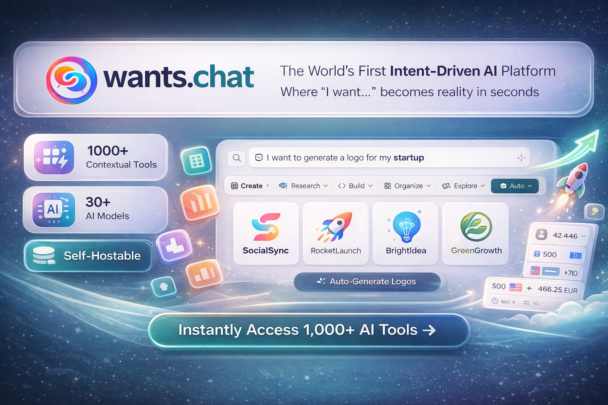

<div align="center">
  

  # wants.chat

  [](https://wants.chat)
  [](LICENSE)
  [](https://github.com/wants-chat/wants-chat/stargazers)
  [](https://github.com/wants-chat/wants-chat/graphs/contributors)

  *One platform that replaces 100+ apps you use daily*

</div>

---

## 🎯 What is wants.chat?

**wants.chat** is a revolutionary AI-powered platform that understands what you want and instantly provides the right tool, app, or automation to get it done. Unlike traditional chatbots that only respond with text, wants.chat detects your intent and renders **contextual user interfaces** tailored to your exact needs.

```
💬 You say: "I want to convert 500 USD to EUR"
✨ wants.chat: Instantly shows a beautiful currency converter UI with live rates

💬 You say: "I want to generate a logo for my startup"
✨ wants.chat: Opens AI image generator with logo templates pre-loaded

💬 You say: "I want to track my project expenses"
✨ wants.chat: Displays expense tracker with your currency, categories, and export options
```

### 🚀 The Problem We Solve

In 2025, the average knowledge worker uses **50+ different apps** daily:
- Calculators, converters, generators
- Project management tools
- Design software
- Finance trackers
- Health apps
- And dozens more...

**wants.chat combines them ALL into one intelligent platform.**

---

## 🚀 Why this project matters

We believe AI should not just talk — it should **DO**.

---

## 🏆 What Makes wants.chat UNIQUE

<table>
<tr>
<td width="50%">

### ❌ Traditional AI Chatbots
- Only generate text responses
- Static conversation interface
- No contextual tools
- Can't build apps
- Single-purpose design

</td>
<td width="50%">

### ✅ wants.chat
- **Intent Detection** → Shows relevant UI
- **1,000+ Contextual Tools** → Ready to use
- **No-Code App Builder** → Full-stack apps
- **Workflow Automation** → n8n-style flows
- **Multi-Model AI** → 30+ models across 8 providers

</td>
</tr>
</table>

### 🎯 The Innovation: Intent → Contextual UI

```
┌─────────────────────────────────────────────────────────────────┐
│                     TRADITIONAL CHATBOTS                        │
├─────────────────────────────────────────────────────────────────┤
│   User: "Calculate my BMI"                                      │
│   Bot: "To calculate BMI, divide weight by height squared..."   │
│   User: [Still needs to find a calculator]                      │
└─────────────────────────────────────────────────────────────────┘

┌─────────────────────────────────────────────────────────────────┐
│                        wants.chat                               │
├─────────────────────────────────────────────────────────────────┤
│   User: "Calculate my BMI"                                      │
│                                                                 │
│   ┌─────────────────────────────────────┐                       │
│   │  BMI Calculator                     │                       │
│   │  ─────────────────────────          │                       │
│   │  Height: [175] cm                   │                       │
│   │  Weight: [70] kg                    │                       │
│   │                                     │                       │
│   │  Your BMI: 22.9 (Normal)            │                       │
│   │  ▓▓▓▓▓▓▓▓▓░░░░░░░░░░░               │                       │
│   │                                     │                       │
│   │  [Export PDF] [Track History]       │                       │
│   └─────────────────────────────────────┘                       │
└─────────────────────────────────────────────────────────────────┘
```

---

## 🌟 Core Features

### 1️⃣ **1,000+ Contextual Tools** (Growing Daily)

<details>
<summary><b>📊 Calculators & Converters (80+)</b></summary>

- Currency Converter (150+ currencies, live rates)
- BMI Calculator
- Loan Calculator
- Compound Interest
- Unit Converters (Length, Weight, Temperature, etc.)
- Date Calculator
- Percentage Calculator
- Mortgage Calculator
- Tip Calculator
- Age Calculator
- Time Zone Converter
- And 70+ more...
</details>

<details>
<summary><b>✍️ AI Writing Tools (50+)</b></summary>

- Blog Post Generator
- Email Composer
- Cover Letter Writer
- Resume Builder
- Social Media Post Generator
- Product Description Writer
- SEO Meta Tag Generator
- Press Release Generator
- Speech Writer
- Story Generator
- And 40+ more...
</details>

<details>
<summary><b>🎨 AI Creative Tools (40+)</b></summary>

- AI Image Generator (FLUX, SDXL)
- AI Logo Generator
- AI Video Generator
- Background Remover
- Image Upscaler
- Photo Enhancer
- Meme Generator
- Avatar Generator
- Banner Designer
- Icon Generator
- And 30+ more...
</details>

<details>
<summary><b>💼 Business Tools (100+)</b></summary>

- Invoice Generator
- Contract Generator
- Proposal Builder
- Business Plan Writer
- Meeting Notes
- Project Timeline
- Kanban Board
- Quote Builder
- Expense Tracker
- Time Tracker
- And 90+ more...
</details>

<details>
<summary><b>⚖️ Legal Tools (25+)</b></summary>

- Case Intake
- Client Agreement
- Court Calendar
- Deposition Scheduler
- Document Review
- Matter Management
- Time Entry (UTBMS/LEDES)
- Trust Account
- Conflict Check
- Witness List
- Legal Research
- Pleading Drafter
- And more...
</details>

<details>
<summary><b>🏥 Healthcare Tools (30+)</b></summary>

- Patient Intake
- Medical History
- Lab Results Tracker
- Medication Reminder
- Insurance Verification
- Clinical Notes
- Surgery Scheduler
- Telehealth Scheduler
- HIPAA Compliance
- And more...
</details>

<details>
<summary><b>🏠 Real Estate Tools (30+)</b></summary>

- Property Listing
- Rental Application
- Lease Agreement
- Mortgage Pre-Qualification
- Home Valuation
- Open House Scheduler
- Rent Roll
- Security Deposit Tracker
- Property Inspection
- And more...
</details>

<details>
<summary><b>🍽️ Restaurant & Hospitality (20+)</b></summary>

- Table Management
- Waitlist Manager
- Kitchen Display
- Menu Engineering
- Recipe Costing
- Food Cost Calculator
- Temperature Log
- Tip Pool Calculator
- And more...
</details>

<details>
<summary><b>🏭 Manufacturing & Logistics (20+)</b></summary>

- BOM Manager
- Quality Inspection
- Machine Maintenance
- Production Scheduler
- Inventory Manager
- Fleet Manager
- Shipment Tracker
- And more...
</details>

<details>
<summary><b>🏫 Education & Childcare (15+)</b></summary>

- Student Database
- Gradebook
- Lesson Planner
- Daily Report (Daycare)
- Child Profile
- Incident Report
- Tuition Tracker
- And more...
</details>

### 2️⃣ **No-Code App Builder**

Build complete full-stack applications without writing code:

- **Frontend**: React components with Tailwind CSS
- **Backend**: Hono.js APIs with PostgreSQL
- **Deploy**: One-click deployment

```
📱 What You Can Build:
├── Customer portals
├── Internal dashboards
├── E-commerce stores
├── Booking systems
├── CRM applications
├── Inventory management
├── And literally ANY app you imagine
```

### 3️⃣ **Multi-Model AI Engine**

Choose from 30+ AI models:

| Provider | Models |
|----------|--------|
| **OpenAI** | GPT-4o, GPT-4o Mini |
| **Anthropic** | Claude Opus 4.5, Claude Sonnet 4.5, Claude Haiku 4.5 |
| **Google** | Gemini 2.5 Pro, Gemini 2.5 Flash |
| **DeepSeek** | DeepSeek V3, DeepSeek R1 |
| **Meta** | Llama 3.3 70B |
| **Image AI** | FLUX, SDXL, Juggernaut |
| **Video AI** | Vidu, KlingAI, ByteDance |

### 4️⃣ **Workflow Automation** (FluxTurn Integration)

Visual workflow builder like n8n/Zapier:

- **500+ Connectors**: Google, Slack, GitHub, Notion, Salesforce, etc.
- **AI Nodes**: GPT, Claude, image generation in workflows
- **Triggers**: Webhooks, schedules, events
- **Self-hostable**: Run on your own infrastructure

### 5️⃣ **Smart Context System**

Your data, pre-filled automatically:

```
┌─────────────────────────────────────────────────────────────┐
│                 3 PILLARS OF CONTEXT                        │
├─────────────────────────────────────────────────────────────┤
│                                                             │
│  1. ONBOARDING DATA                                         │
│     Currency, timezone, language, industry preferences      │
│                                                             │
│  2. CONTEXTUAL UI HISTORY                                   │
│     Remembers your last inputs for each tool                │
│                                                             │
│  3. CHAT INTELLIGENCE                                       │
│     Extracts entities from conversation                     │
│     "Budget $5000" → Pre-fills budget calculators           │
│                                                             │
└─────────────────────────────────────────────────────────────┘
```

### 6️⃣ **Export Everything**

Every tool supports comprehensive export:

- 📄 **PDF** - Professional documents
- 📊 **Excel** - Spreadsheets with formatting
- 📋 **CSV** - Universal data format
- 🔗 **JSON** - For developers
- 🖨️ **Print** - Optimized layouts

---

## 📊 Competitive Analysis

### What wants.chat Replaces

_Typical standard-tier pricing as of December 2025; actual figures vary by plan and seat count._

<table>
<tr><th>Category</th><th>Apps Replaced</th><th>Annual Savings</th></tr>
<tr><td>AI Assistants</td><td>ChatGPT Plus, Claude Pro, Gemini Advanced</td><td>$720/year</td></tr>
<tr><td>Design Tools</td><td>Canva Pro, Adobe Express, Figma</td><td>$360/year</td></tr>
<tr><td>Writing Tools</td><td>Jasper, Copy.ai, Writesonic</td><td>$1,000/year</td></tr>
<tr><td>Project Management</td><td>Monday, Asana, Notion</td><td>$360/year</td></tr>
<tr><td>Automation</td><td>Zapier, Make, n8n Cloud</td><td>$480/year</td></tr>
<tr><td>App Building</td><td>Bubble, Webflow, Retool</td><td>$750/year</td></tr>
<tr><td><b>TOTAL</b></td><td>18 apps</td><td><b>$3,670/year saved</b></td></tr>
</table>

### Feature Comparison (December 2025)

| Feature | ChatGPT | Claude | Poe | 1min.AI | Manus | **wants.chat** |
|---------|---------|--------|-----|---------|-------|----------------|
| Multi-Model AI | ❌ | ❌ | ✅ | ✅ | ✅ | ✅ **30+ models** |
| AI Image Generation | ✅ | ❌ | ✅ | ✅ | ✅ | ✅ **FLUX + SDXL** |
| AI Video Generation | ✅ Sora | ❌ | ✅ | ✅ | ❌ | ✅ **3 engines** |
| Contextual UI Tools | ❌ | Artifacts | ❌ | ❌ | ❌ | ✅ **1,000+ tools** |
| No-Code App Builder | ❌ | ❌ | ❌ | ❌ | ✅ | ✅ **Full-stack** |
| Workflow Automation | ❌ | ❌ | ❌ | ❌ | ❌ | ✅ **500+ connectors** |
| Browser Extension | ❌ | ❌ | ❌ | ❌ | ❌ | ✅ **Chrome/Firefox** |
| Self-Hosting | ❌ | ❌ | ❌ | ❌ | ✅ | ✅ **Docker ready** |

---

## 🔮 Roadmap

### ✅ Implemented

- [x] 1,000+ Contextual UI Tools
- [x] Multi-model AI chat (30+ models)
- [x] AI Image Generation (FLUX, SDXL)
- [x] AI Video Generation (Vidu, KlingAI)
- [x] Tool data sync to backend
- [x] Export (PDF, Excel, CSV, JSON)
- [x] User onboarding flow
- [x] Stripe billing integration
- [x] Browser extension (Chrome/Firefox)
- [x] Organization/team support
- [x] Vector search for tools (Qdrant)
- [x] Dark/Light theme

### 🚧 In Progress

- [ ] Workflow automation (FluxTurn)
- [ ] URL Detection + Auto-Summarize
- [ ] Screenshot & Page Analysis
- [ ] Research Mode (deep web search)
- [ ] No-code app builder v2
- [ ] Chatbot deployment (WhatsApp, LINE, Telegram)

### 📋 Planned

- [ ] API marketplace
- [ ] Plugin system
- [ ] Real-time collaboration
- [ ] AI agents (autonomous tasks)
- [ ] Voice interface
- [ ] MCP integration

---

## 🛠️ Tech Stack

### Frontend
- **React 18** + TypeScript
- **Vite** build tooling
- **Tailwind CSS** + shadcn/ui
- **Framer Motion** for animations
- **TanStack Query** for data fetching
- **i18next** for internationalization

### Backend
- **NestJS** (Node.js framework)
- **PostgreSQL** database (raw `pg` driver)
- **Qdrant** vector database (optional)
- **Redis** (via BullMQ queues)
- **Socket.io** for real-time communication
- **Swagger/OpenAPI** for API documentation

### Browser Extension
- **Vite** + **TypeScript**
- **Manifest V3** (Chrome, Edge, Firefox)
- Shares React components with the web app via source-level imports

### AI/ML
- **OpenRouter** unified LLM gateway (30+ models)
- **Runware** for image generation
- **OpenAI Embeddings** for semantic search

### Infrastructure
- **Docker** + Docker Compose
- **Cloudflare R2** storage
- Self-hostable on any cloud provider

---

## 🚀 Getting Started

The fastest path:

```bash
git clone https://github.com/wants-chat/wants-chat.git
cd wants-chat
cp backend/.env.example backend/.env
cp frontend/.env.example frontend/.env
docker compose up
```

Then open `http://localhost:5173`.

For prerequisites, env vars, the no-Docker path, optional features, and troubleshooting, see **[`DEVELOPMENT.md`](DEVELOPMENT.md)** — the canonical contributor onboarding guide.

---

## 🧩 Browser Extension

A Manifest V3 browser extension lives in [`extension/`](extension/) and brings wants.chat into any tab — invoke tools on highlighted text, save snippets, and chat without leaving the page.

```bash
cd extension
npm install
npm run build
# Then load extension/dist as an unpacked extension in Chrome/Edge/Firefox
```

---

## 🤝 Contributing

We welcome contributions! Start with the [Contributing Guide](CONTRIBUTING.md) and the [Code of Conduct](CODE_OF_CONDUCT.md).

- **[CONTRIBUTING.md](CONTRIBUTING.md)** — how to propose changes, branch, and open a PR
- **[DEVELOPMENT.md](DEVELOPMENT.md)** — local setup and contributor onboarding
- **[CODE_OF_CONDUCT.md](CODE_OF_CONDUCT.md)** — community standards
- **[SECURITY.md](SECURITY.md)** — how to report a vulnerability
- **[CHANGELOG.md](CHANGELOG.md)** — release notes and version history

---

## 📄 License

This project is licensed under the **AGPL-3.0 License** - see the [LICENSE](LICENSE) file for details.

This means you can freely use, modify, and distribute this software, but any modifications must also be open-sourced under the same license.

---

## 🙏 Acknowledgments

- [OpenRouter](https://openrouter.ai) - LLM API gateway
- [Runware](https://runware.ai) - Image generation API
- [Qdrant](https://qdrant.tech) - Vector database
- [shadcn/ui](https://ui.shadcn.com) - UI components

---

<div align="center">

### 💬 Connect With Us

[](https://wants.chat)
[](https://twitter.com/wantschat)
[](https://discord.gg/wantschat)
[](mailto:hello@wants.chat)

---

**Built with ❤️ by the wants.chat community**

*If you find this project useful, please consider giving it a star!*

</div>
