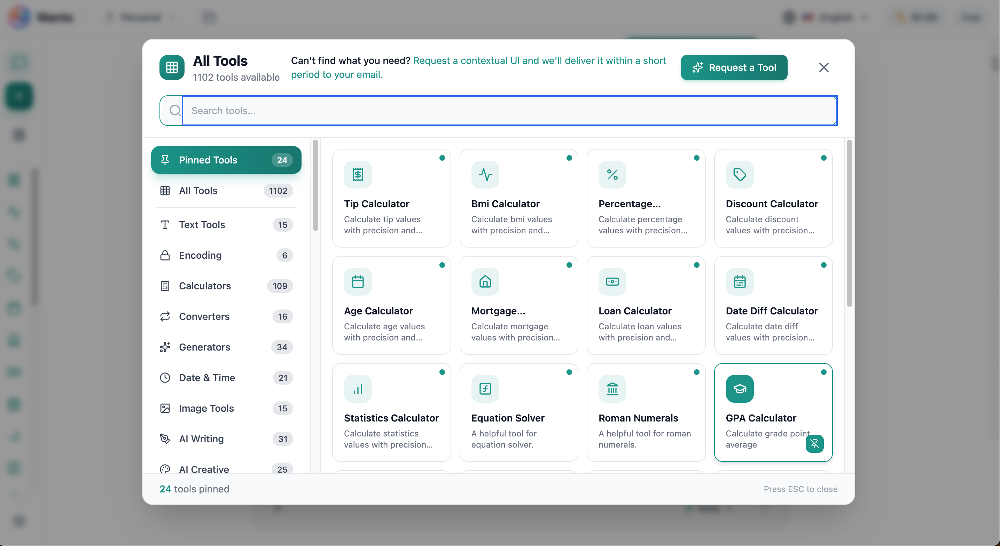
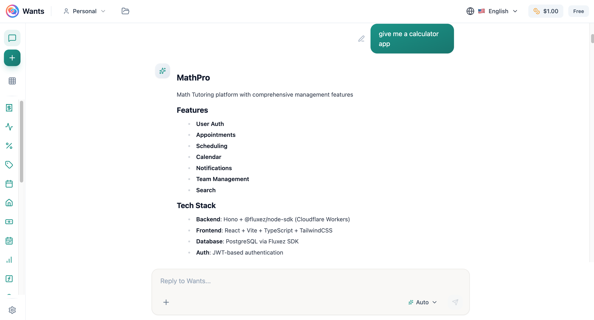

<div align="center">
  <a href="https://wants.chat">
    
  </a>

  # WantsChat

  [](https://wants.chat)
  [](LICENSE)
  [](https://github.com/wants-chat/wants-chat/stargazers)
  [](https://github.com/wants-chat/wants-chat/network/members)
  [](https://github.com/wants-chat/wants-chat/graphs/contributors)

  **No solo chatees. Construye lo que necesitas.**

  *WantsChat es donde tus ideas, tareas y diligencias se hacen realidad — en un único lugar amigable, con una sola petición sencilla.*

  <p>
    <a href="./README.md">English</a> |
    <a href="./README_JA.md">日本語</a> |
    <a href="./README_ZH.md">中文</a> |
    <a href="./README_KO.md">한국어</a> |
    <a href="./README_ES.md">Español</a> |
    <a href="./README_FR.md">Français</a> |
    <a href="./README_DE.md">Deutsch</a> |
    <a href="./README_PT-BR.md">Português</a> |
    <a href="./README_RU.md">Русский</a> |
    <a href="./README_AR.md">العربية</a> |
    <a href="./README_IT.md">Italiano</a> |
    <a href="./README_HI.md">हिन्दी</a> |
    <a href="./README_TR.md">Türkçe</a> |
    <a href="./README_ID.md">Bahasa Indonesia</a> |
    <a href="./README_VI.md">Tiếng Việt</a> |
    <a href="./README_NL.md">Nederlands</a> |
    <a href="./README_UK.md">Українська</a>
  </p>
  


</div>

---

## 🎯 ¿Qué es WantsChat?

**WantsChat** es una plataforma revolucionaria impulsada por IA que entiende lo que quieres y proporciona al instante la herramienta, app o automatización adecuada para llevarlo a cabo. A diferencia de los chatbots tradicionales que solo responden con texto, WantsChat detecta tu intención y renderiza **interfaces de usuario contextuales** adaptadas a tus necesidades exactas.

```
💬 Tú dices: "Quiero convertir 500 USD a EUR"
✨ WantsChat: Muestra al instante un hermoso conversor de divisas con tasas en vivo

💬 Tú dices: "Quiero generar un logo para mi startup"
✨ WantsChat: Abre el generador de imágenes con IA con plantillas de logo precargadas

💬 Tú dices: "Quiero llevar el control de los gastos de mi proyecto"
✨ WantsChat: Muestra un rastreador de gastos con tu moneda, categorías y opciones de exportación
```

### 🚀 El problema que resolvemos

En 2025, el trabajador del conocimiento promedio utiliza **más de 50 apps** distintas a diario:
- Calculadoras, conversores, generadores
- Herramientas de gestión de proyectos
- Software de diseño
- Rastreadores financieros
- Apps de salud
- Y docenas más...

**WantsChat las combina TODAS en una única plataforma inteligente.**

---

## 🚀 Por qué este proyecto importa

Creemos que la IA no debería solo hablar — debería **HACER**.

---

## 🏆 Lo que hace a WantsChat ÚNICO

<table>
<tr>
<td width="50%">

### ❌ Chatbots de IA tradicionales
- Solo generan respuestas de texto
- Interfaz de conversación estática
- Sin herramientas contextuales
- No pueden construir apps
- Diseño de propósito único

</td>
<td width="50%">

### ✅ WantsChat
- **Detección de intención** → Muestra la UI relevante
- **Más de 1.100 herramientas contextuales** → Listas para usar
- **Constructor de apps sin código** → Aplicaciones full-stack
- **Automatización de flujos** → Flujos al estilo n8n
- **IA multimodelo** → Más de 30 modelos de 8 proveedores

</td>
</tr>
</table>

### 🎯 La innovación: Intención → UI contextual

```
┌─────────────────────────────────────────────────────────────────┐
│                  CHATBOTS TRADICIONALES                         │
├─────────────────────────────────────────────────────────────────┤
│   Usuario: "Calcula mi IMC"                                     │
│   Bot: "Para calcular el IMC, divide el peso por la altura..."  │
│   Usuario: [Aún necesita encontrar una calculadora]             │
└─────────────────────────────────────────────────────────────────┘

┌─────────────────────────────────────────────────────────────────┐
│                        WantsChat                                │
├─────────────────────────────────────────────────────────────────┤
│   Usuario: "Calcula mi IMC"                                     │
│                                                                 │
│   ┌─────────────────────────────────────┐                       │
│   │  BMI Calculator                     │                       │
│   │  ─────────────────────────          │                       │
│   │  Altura: [175] cm                   │                       │
│   │  Peso:   [70]  kg                   │                       │
│   │                                     │                       │
│   │  Tu IMC: 22.9 (Normal)              │                       │
│   │  ▓▓▓▓▓▓▓▓▓░░░░░░░░░░░               │                       │
│   │                                     │                       │
│   │  [Exportar PDF] [Ver historial]     │                       │
│   └─────────────────────────────────────┘                       │
└─────────────────────────────────────────────────────────────────┘
```

---

## 🌟 Características principales

### 1️⃣ **Más de 1.100 herramientas contextuales** (creciendo a diario)

<div align="center">
  
</div>

<details>
<summary><b>📊 Calculadoras y conversores (más de 80)</b></summary>

- Currency Converter (más de 150 monedas, tasas en vivo)
- BMI Calculator
- Loan Calculator
- Compound Interest
- Unit Converters (longitud, peso, temperatura, etc.)
- Date Calculator
- Percentage Calculator
- Mortgage Calculator
- Tip Calculator
- Age Calculator
- Time Zone Converter
- Y más de 70 más...
</details>

<details>
<summary><b>✍️ Herramientas de escritura con IA (más de 50)</b></summary>

- Blog Post Generator
- Email Composer
- Cover Letter Writer
- Resume Builder
- Social Media Post Generator
- Product Description Writer
- SEO Meta Tag Generator
- Press Release Generator
- Speech Writer
- Story Generator
- Y más de 40 más...
</details>

<details>
<summary><b>🎨 Herramientas creativas con IA (más de 40)</b></summary>

- AI Image Generator (FLUX, SDXL)
- AI Logo Generator
- AI Video Generator
- Background Remover
- Image Upscaler
- Photo Enhancer
- Meme Generator
- Avatar Generator
- Banner Designer
- Icon Generator
- Y más de 30 más...
</details>

<details>
<summary><b>💼 Herramientas de negocio (más de 100)</b></summary>

- Invoice Generator
- Contract Generator
- Proposal Builder
- Business Plan Writer
- Meeting Notes
- Project Timeline
- Kanban Board
- Quote Builder
- Expense Tracker
- Time Tracker
- Y más de 90 más...
</details>

<details>
<summary><b>⚖️ Herramientas legales (más de 25)</b></summary>

- Case Intake
- Client Agreement
- Court Calendar
- Deposition Scheduler
- Document Review
- Matter Management
- Time Entry (UTBMS/LEDES)
- Trust Account
- Conflict Check
- Witness List
- Legal Research
- Pleading Drafter
- Y más...
</details>

<details>
<summary><b>🏥 Herramientas sanitarias (más de 30)</b></summary>

- Patient Intake
- Medical History
- Lab Results Tracker
- Medication Reminder
- Insurance Verification
- Clinical Notes
- Surgery Scheduler
- Telehealth Scheduler
- HIPAA Compliance
- Y más...
</details>

<details>
<summary><b>🏠 Herramientas inmobiliarias (más de 30)</b></summary>

- Property Listing
- Rental Application
- Lease Agreement
- Mortgage Pre-Qualification
- Home Valuation
- Open House Scheduler
- Rent Roll
- Security Deposit Tracker
- Property Inspection
- Y más...
</details>

<details>
<summary><b>🍽️ Restauración y hostelería (más de 20)</b></summary>

- Table Management
- Waitlist Manager
- Kitchen Display
- Menu Engineering
- Recipe Costing
- Food Cost Calculator
- Temperature Log
- Tip Pool Calculator
- Y más...
</details>

<details>
<summary><b>🏭 Manufactura y logística (más de 20)</b></summary>

- BOM Manager
- Quality Inspection
- Machine Maintenance
- Production Scheduler
- Inventory Manager
- Fleet Manager
- Shipment Tracker
- Y más...
</details>

<details>
<summary><b>🏫 Educación y guardería (más de 15)</b></summary>

- Student Database
- Gradebook
- Lesson Planner
- Daily Report (Daycare)
- Child Profile
- Incident Report
- Tuition Tracker
- Y más...
</details>

### 2️⃣ **Constructor de apps sin código**

<div align="center">
  
</div>

Construye aplicaciones full-stack completas sin escribir código:

- **Frontend**: Componentes React con Tailwind CSS
- **Backend**: APIs en Hono.js con PostgreSQL
- **Despliegue**: Despliegue con un solo clic

```
📱 Lo que puedes construir:
├── Portales de cliente
├── Paneles internos
├── Tiendas de e-commerce
├── Sistemas de reservas
├── Aplicaciones CRM
├── Gestión de inventario
├── Y literalmente CUALQUIER app que imagines
```

### 3️⃣ **Motor de IA multimodelo**

Elige entre más de 30 modelos de IA:

| Proveedor | Modelos |
|-----------|---------|
| **OpenAI** | GPT-4o, GPT-4o Mini |
| **Anthropic** | Claude Opus 4.5, Claude Sonnet 4.5, Claude Haiku 4.5 |
| **Google** | Gemini 2.5 Pro, Gemini 2.5 Flash |
| **DeepSeek** | DeepSeek V3, DeepSeek R1 |
| **Meta** | Llama 3.3 70B |
| **Image AI** | FLUX, SDXL, Juggernaut |
| **Video AI** | Vidu, KlingAI, ByteDance |

### 4️⃣ **Automatización de flujos** (Integración con FluxTurn)

Constructor visual de flujos como n8n/Zapier:

- **Más de 500 conectores**: Google, Slack, GitHub, Notion, Salesforce, etc.
- **Nodos de IA**: GPT, Claude, generación de imágenes en flujos
- **Disparadores**: Webhooks, programaciones, eventos
- **Auto-alojable**: Ejecútalo en tu propia infraestructura

### 5️⃣ **Sistema inteligente de contexto**

Tus datos, rellenados automáticamente:

```
┌─────────────────────────────────────────────────────────────┐
│              3 PILARES DEL CONTEXTO                         │
├─────────────────────────────────────────────────────────────┤
│                                                             │
│  1. DATOS DE INCORPORACIÓN                                  │
│     Moneda, zona horaria, idioma, sector preferido          │
│                                                             │
│  2. HISTORIAL DE UI CONTEXTUAL                              │
│     Recuerda tus últimas entradas para cada herramienta     │
│                                                             │
│  3. INTELIGENCIA DE CHAT                                    │
│     Extrae entidades de la conversación                     │
│     "Presupuesto $5000" → Rellena calculadoras              │
│                                                             │
└─────────────────────────────────────────────────────────────┘
```

### 6️⃣ **Exporta todo**

Cada herramienta admite exportación completa:

- 📄 **PDF** - Documentos profesionales
- 📊 **Excel** - Hojas de cálculo con formato
- 📋 **CSV** - Formato universal de datos
- 🔗 **JSON** - Para desarrolladores
- 🖨️ **Imprimir** - Diseños optimizados

---

## 📊 Análisis competitivo

### Lo que WantsChat reemplaza

_Precios típicos del nivel estándar a diciembre de 2025; las cifras reales varían según el plan y el número de licencias._

<table>
<tr><th>Categoría</th><th>Apps reemplazadas</th><th>Ahorro anual</th></tr>
<tr><td>Asistentes de IA</td><td>ChatGPT Plus, Claude Pro, Gemini Advanced</td><td>$720/año</td></tr>
<tr><td>Herramientas de diseño</td><td>Canva Pro, Adobe Express, Figma</td><td>$360/año</td></tr>
<tr><td>Herramientas de escritura</td><td>Jasper, Copy.ai, Writesonic</td><td>$1.000/año</td></tr>
<tr><td>Gestión de proyectos</td><td>Monday, Asana, Notion</td><td>$360/año</td></tr>
<tr><td>Automatización</td><td>Zapier, Make, n8n Cloud</td><td>$480/año</td></tr>
<tr><td>Construcción de apps</td><td>Bubble, Webflow, Retool</td><td>$750/año</td></tr>
<tr><td><b>TOTAL</b></td><td>18 apps</td><td><b>$3.670/año ahorrados</b></td></tr>
</table>

### Comparación de características (diciembre 2025)

| Característica | ChatGPT | Claude | Poe | 1min.AI | Manus | **WantsChat** |
|----------------|---------|--------|-----|---------|-------|----------------|
| IA multimodelo | ❌ | ❌ | ✅ | ✅ | ✅ | ✅ **Más de 30 modelos** |
| Generación de imágenes con IA | ✅ | ❌ | ✅ | ✅ | ✅ | ✅ **FLUX + SDXL** |
| Generación de vídeo con IA | ✅ Sora | ❌ | ✅ | ✅ | ❌ | ✅ **3 motores** |
| Herramientas de UI contextual | ❌ | Artifacts | ❌ | ❌ | ❌ | ✅ **Más de 1.100 herramientas** |
| Constructor de apps sin código | ❌ | ❌ | ❌ | ❌ | ✅ | ✅ **Full-stack** |
| Automatización de flujos | ❌ | ❌ | ❌ | ❌ | ❌ | ✅ **Más de 500 conectores** |
| Extensión de navegador | ❌ | ❌ | ❌ | ❌ | ❌ | ✅ **Chrome/Firefox** |
| Auto-alojamiento | ❌ | ❌ | ❌ | ❌ | ✅ | ✅ **Listo para Docker** |

---

## 🔮 Hoja de ruta

### ✅ Implementado

- [x] Más de 1.100 herramientas de UI contextual
- [x] Chat de IA multimodelo (más de 30 modelos)
- [x] Generación de imágenes con IA (FLUX, SDXL)
- [x] Generación de vídeo con IA (Vidu, KlingAI)
- [x] Sincronización de datos de herramientas con el backend
- [x] Exportación (PDF, Excel, CSV, JSON)
- [x] Flujo de incorporación de usuarios
- [x] Extensión de navegador (Chrome/Firefox)
- [x] Soporte para organizaciones/equipos
- [x] Búsqueda vectorial de herramientas (Qdrant)
- [x] Tema oscuro/claro

### 🚧 En curso

- [ ] Automatización de flujos (FluxTurn)
- [ ] Detección de URL + auto-resumen
- [ ] Captura de pantalla y análisis de página
- [ ] Modo investigación (búsqueda web profunda)
- [ ] Constructor de apps sin código v2
- [ ] Despliegue de chatbots (WhatsApp, LINE, Telegram)

### 📋 Planificado

- [ ] Marketplace de APIs
- [ ] Sistema de plugins
- [ ] Colaboración en tiempo real
- [ ] Agentes de IA (tareas autónomas)
- [ ] Interfaz por voz
- [ ] Integración MCP

---

## 🛠️ Pila tecnológica

### Frontend
- **React 18** + TypeScript
- **Vite** como herramienta de build
- **Tailwind CSS** + shadcn/ui
- **Framer Motion** para animaciones
- **TanStack Query** para obtención de datos
- **i18next** para internacionalización

### Backend
- **NestJS** (framework de Node.js)
- Base de datos **PostgreSQL** (driver `pg` puro)
- Base de datos vectorial **Qdrant** (opcional)
- **Redis** (mediante colas BullMQ)
- **Socket.io** para comunicación en tiempo real
- **Swagger/OpenAPI** para documentación de la API

### Extensión de navegador
- **Vite** + **TypeScript**
- **Manifest V3** (Chrome, Edge, Firefox)
- Comparte componentes React con la app web mediante imports a nivel de código fuente

### IA/ML
- Pasarela LLM unificada **OpenRouter** (más de 30 modelos)
- **Runware** para generación de imágenes
- **OpenAI Embeddings** para búsqueda semántica

### Infraestructura
- **Docker** + Docker Compose
- Almacenamiento **Cloudflare R2**
- Auto-alojable en cualquier proveedor de nube

---

## 🚀 Cómo empezar

La vía más rápida:

```bash
git clone https://github.com/wants-chat/wants-chat.git
cd wants-chat
cp backend/.env.example backend/.env
cp frontend/.env.example frontend/.env
docker compose up
```

Luego abre `http://localhost:5173`.

Para los requisitos previos, variables de entorno, la vía sin Docker, características opcionales y resolución de problemas, consulta **[`DEVELOPMENT.md`](DEVELOPMENT.md)** — la guía canónica de incorporación para colaboradores.

---

## 🧩 Extensión de navegador

Una extensión de navegador Manifest V3 vive en [`extension/`](extension/) y lleva WantsChat a cualquier pestaña — invoca herramientas sobre el texto resaltado, guarda fragmentos y chatea sin abandonar la página.

```bash
cd extension
npm install
npm run build
# Luego carga extension/dist como una extensión sin empaquetar en Chrome/Edge/Firefox
```

---

## 🤝 Contribuir

¡Damos la bienvenida a las contribuciones! Empieza con la [Guía de contribución](CONTRIBUTING.md) y el [Código de conducta](CODE_OF_CONDUCT.md).

- **[CONTRIBUTING.md](CONTRIBUTING.md)** — cómo proponer cambios, ramas y abrir un PR
- **[DEVELOPMENT.md](DEVELOPMENT.md)** — configuración local e incorporación de colaboradores
- **[CODE_OF_CONDUCT.md](CODE_OF_CONDUCT.md)** — normas de la comunidad
- **[SECURITY.md](SECURITY.md)** — cómo reportar una vulnerabilidad
- **[CHANGELOG.md](CHANGELOG.md)** — notas de versión e historial

---

## Colaboradores

¡Gracias a todas las personas increíbles que han contribuido a WantsChat! 🎉

<a href="https://github.com/wants-chat/wants-chat/graphs/contributors">
  
</a>

¿Quieres ver tu cara aquí? Echa un vistazo a nuestra [Guía de contribución](CONTRIBUTING.md) y comienza a contribuir hoy.

---

## 📄 Licencia

Este proyecto está licenciado bajo la **Licencia AGPL-3.0** - consulta el archivo [LICENSE](LICENSE) para más detalles.

Esto significa que puedes usar, modificar y distribuir libremente este software, pero cualquier modificación también debe publicarse como código abierto bajo la misma licencia.

---

## 🙏 Agradecimientos

- [OpenRouter](https://openrouter.ai) - Pasarela de API para LLM
- [Runware](https://runware.ai) - API de generación de imágenes
- [Qdrant](https://qdrant.tech) - Base de datos vectorial
- [shadcn/ui](https://ui.shadcn.com) - Componentes de UI

---

<div align="center">

### 💬 Conecta con nosotros

[](https://wants.chat)
[](https://twitter.com/wantschat)
[](https://discord.gg/wantschat)
[](mailto:hello@wants.chat)

---

**Construido con ❤️ por la comunidad de WantsChat**

*Si encuentras útil este proyecto, ¡considera darle una estrella!*

</div>
